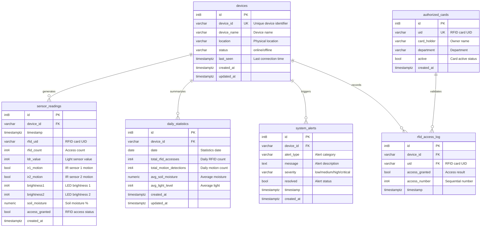

# SmartOS Database Schema

## Complete SQL Schema

```sql
-- Table: authorized_cards
-- Purpose: List of authorized RFID cards
CREATE TABLE public.authorized_cards (
    id bigint NOT NULL DEFAULT nextval('authorized_cards_id_seq'::regclass),
    uid character varying NOT NULL UNIQUE,
    card_holder character varying,
    department character varying,
    active boolean DEFAULT true,
    created_at timestamp with time zone DEFAULT now(),
    CONSTRAINT authorized_cards_pkey PRIMARY KEY (id)
);

-- Table: devices
-- Purpose: Central registry of all ESP32 devices
CREATE TABLE public.devices (
    id bigint NOT NULL DEFAULT nextval('devices_id_seq'::regclass),
    device_id character varying NOT NULL UNIQUE,
    device_name character varying,
    location character varying,
    status character varying DEFAULT 'active'::character varying,
    last_seen timestamp with time zone,
    created_at timestamp with time zone DEFAULT now(),
    updated_at timestamp with time zone DEFAULT now(),
    CONSTRAINT devices_pkey PRIMARY KEY (id)
);

-- Table: sensor_readings
-- Purpose: Real-time sensor data from ESP32 devices
CREATE TABLE public.sensor_readings (
    id bigint NOT NULL DEFAULT nextval('sensor_readings_id_seq'::regclass),
    device_id character varying NOT NULL,
    timestamp timestamp with time zone DEFAULT now(),
    rfid_uid character varying,
    rfid_count integer,
    ldr_value integer,
    ir1_motion boolean,
    ir2_motion boolean,
    brightness1 integer,
    brightness2 integer,
    soil_moisture numeric,
    created_at timestamp with time zone DEFAULT now(),
    access_granted boolean DEFAULT true,
    CONSTRAINT sensor_readings_pkey PRIMARY KEY (id)
);

-- Table: rfid_access_log
-- Purpose: Detailed log of all RFID access attempts
CREATE TABLE public.rfid_access_log (
    id bigint NOT NULL DEFAULT nextval('rfid_access_log_id_seq'::regclass),
    device_id character varying NOT NULL,
    uid character varying NOT NULL,
    access_granted boolean DEFAULT true,
    access_number integer,
    timestamp timestamp with time zone DEFAULT now(),
    CONSTRAINT rfid_access_log_pkey PRIMARY KEY (id)
);

-- Table: daily_statistics
-- Purpose: Aggregated daily summaries per device
CREATE TABLE public.daily_statistics (
    id bigint NOT NULL DEFAULT nextval('daily_statistics_id_seq'::regclass),
    device_id character varying NOT NULL,
    date date NOT NULL,
    total_rfid_accesses integer DEFAULT 0,
    total_motion_detections integer DEFAULT 0,
    avg_soil_moisture numeric,
    avg_light_level integer,
    created_at timestamp with time zone DEFAULT now(),
    updated_at timestamp with time zone DEFAULT now(),
    CONSTRAINT daily_statistics_pkey PRIMARY KEY (id)
);

-- Table: system_alerts
-- Purpose: System-generated alerts and notifications
CREATE TABLE public.system_alerts (
    id bigint NOT NULL DEFAULT nextval('system_alerts_id_seq'::regclass),
    device_id character varying NOT NULL,
    alert_type character varying NOT NULL,
    message text NOT NULL,
    severity character varying DEFAULT 'info'::character varying,
    resolved boolean DEFAULT false,
    timestamp timestamp with time zone DEFAULT now(),
    created_at timestamp with time zone DEFAULT now(),
    CONSTRAINT system_alerts_pkey PRIMARY KEY (id)
);
```

---

## Entity Relationship Diagram



---

## Table Descriptions

### 📱 **devices**
Central registry of all ESP32 devices in the system
- **Default status**: `active`
- Tracks device status and connectivity
- Monitors last seen timestamp
- Auto-updates `updated_at` on changes

### 📊 **sensor_readings**
Real-time sensor data from ESP32 devices
- **Default access_granted**: `true`
- **Auto timestamp**: `now()`
- RFID readings
- Light sensor (LDR) values
- IR motion detection (boolean)
- LED brightness levels (0-255)
- Soil moisture percentage (numeric)

### 🔐 **rfid_access_log**
Detailed log of all RFID access attempts
- **Default access_granted**: `true`
- **Auto timestamp**: `now()`
- Links to authorized_cards via `uid`
- Sequential access numbering
- Records granted/denied access

### 👤 **authorized_cards**
Master list of authorized RFID cards
- **Default active**: `true`
- **Unique constraint**: `uid`
- Cardholder information
- Department assignment
- Active/inactive status control

### 📈 **daily_statistics**
Aggregated daily summaries per device
- **Default counters**: `0`
- **Auto timestamps**: `created_at`, `updated_at`
- Total RFID accesses
- Total motion detections
- Average soil moisture
- Average light levels

### 🚨 **system_alerts**
System-generated alerts and notifications
- **Default severity**: `info`
- **Default resolved**: `false`
- **Auto timestamp**: `now()`
- Alert type categorization
- Severity levels: `info`, `warning`, `error`, `critical`
- Resolution tracking

---

## Default Values Summary

| Table | Column | Default Value |
|-------|--------|---------------|
| authorized_cards | active | `true` |
| authorized_cards | created_at | `now()` |
| devices | status | `'active'` |
| devices | created_at | `now()` |
| devices | updated_at | `now()` |
| sensor_readings | timestamp | `now()` |
| sensor_readings | created_at | `now()` |
| sensor_readings | access_granted | `true` |
| rfid_access_log | access_granted | `true` |
| rfid_access_log | timestamp | `now()` |
| daily_statistics | total_rfid_accesses | `0` |
| daily_statistics | total_motion_detections | `0` |
| daily_statistics | created_at | `now()` |
| daily_statistics | updated_at | `now()` |
| system_alerts | severity | `'info'` |
| system_alerts | resolved | `false` |
| system_alerts | timestamp | `now()` |
| system_alerts | created_at | `now()` |

---

## Key Relationships

1. **devices → sensor_readings**: One device generates many sensor readings
2. **devices → rfid_access_log**: One device records many access attempts
3. **devices → daily_statistics**: One device has many daily summaries
4. **devices → system_alerts**: One device triggers many alerts
5. **authorized_cards → rfid_access_log**: One card can have many access attempts

---

## Data Flow

```
ESP32 Device
    ↓
sensor_readings (real-time)
    ↓
Dashboard Analytics
    ↓
daily_statistics (aggregated)
```

```
RFID Scan
    ↓
Check authorized_cards
    ↓
Log to rfid_access_log
    ↓
Generate system_alerts (if denied)
```
